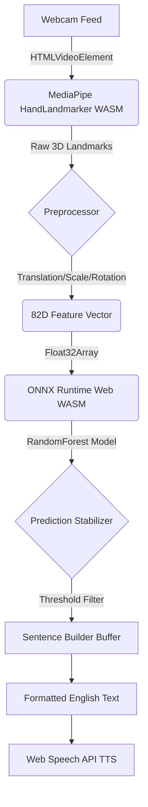

# GESTURA: Isolated Sign & Static Gesture Mapper

Gestura is a client-side, browser-based proof-of-concept for mapping isolated ASL word signs and static fingerspelling. It captures hand landmarks via webcam, extracts normalized geometric features, and classifies isolated gestures in real-time using an ONNX-compiled machine learning model.

## Overview
- **Problem**: Access to basic sign vocabulary mapping is hindered by high-latency cloud services, privacy concerns, and heavy computational requirements.
- **Solution**: A 100% local, privacy-first web application that performs isolated gesture recognition entirely in the browser using WebAssembly.
- **Scope**: Gestura maps *isolated vocabulary words only* (approx. 100-300 signs). It **does not** translate continuous sign language, it **does not** understand ASL grammar, and it **does not** read facial expressions.

## Deaf Community Validation
Before deploying or claiming success for any assistive technology, **it must be validated by and designed with the Deaf community.** Technology built "for" a community without their active participation often solves the wrong problems. We strongly recommend partnering with native ASL signers to evaluate the real-world utility of any application derived from this codebase.

## Key Features
- **Isolated Sign Recognition**: Classifies individual static and temporal hand gestures at 30+ FPS directly in the browser.
- **Sentence Builder**: Automatically transforms a sequence of recognized isolated glosses into grammatically formatted English sentences using deterministic rules.
- **Local Text-to-Speech (TTS)**: Reads out built sentences using the native Web Speech API.
- **Privacy First**: Zero images or video feeds ever leave your device. All inference is run client-side via ONNX WASM.
- **Developer Debug Mode**: A live telemetry HUD tracking frame latency, memory allocation, and raw 82D/227D feature vectors.

## Architecture



## Tech Stack
- **Frontend**: Next.js 14, React 18, Tailwind CSS (Neo-brutalist custom theme)
- **Computer Vision**: `@mediapipe/tasks-vision`
- **Machine Learning Inference**: `onnxruntime-web`
- **Machine Learning Backend**: Python, Scikit-learn, ONNX

## Evaluation Metrics
*Note: These metrics are derived from an extremely small validation set (n=3) and are subject to high variance and single-user bias.*
- **Model**: RandomForest (82D Input)
- **Test Accuracy**: 33.3%
- **Macro F1**: 25.0%
- **Client Inference Latency**: ~11.5ms per frame

## Honest Limitations
1. **Static Gestures Only**: Gestura currently only recognizes fixed poses. It does not track temporal/motion-based signs (e.g., the sign for "J" or full ASL sentences).
2. **Not a Full Translator**: This is a proof-of-concept vocabulary mapper, not a comprehensive ASL-to-English semantic translator.
3. **Small Personal Dataset**: The current bundled model was trained on a highly biased, microscopic dataset (~20 samples total). It will likely fail to generalize to different hand sizes, lighting conditions, or camera angles.
4. **Lighting/Camera Dependence**: MediaPipe's skeleton tracking degrades significantly in low light or high backlight.
5. **TTS Browser Variance**: Depending on your OS and browser, premium TTS voices may silently require an internet connection, breaking offline guarantees.

## Installation & Running Locally

1. **Clone the repository**
   ```bash
   git clone https://github.com/your-username/gestura.git
   cd gestura
   ```
2. **Install Frontend Dependencies**
   ```bash
   cd frontend
   npm install
   ```
3. **Start the Development Server**
   ```bash
   npm run dev
   ```
4. **Open Application**
   Navigate to `http://localhost:3000`

## Project Structure
- `/frontend/src/app` - Next.js Pages (Translate, Model, History)
- `/frontend/src/components` - React UI Components (Neo-brutalist theme)
- `/frontend/src/lib/inference` - ONNX hooks and Geometry Feedback
- `/frontend/src/lib/features` - Hand tracking canonicalization
- `/docs` - Performance, Privacy, QA, and Dataset documentation
- `/models` - `.onnx` and JSON artifacts

## Screenshots
*(Add screenshots to `/docs/screenshots/` before pushing to production)*
- [ ] Landing Page (`home.png`)
- [ ] Translation Studio active (`translate_active.png`)
- [ ] Sentence Builder (`sentence_builder.png`)
- [ ] Model Transparency Page (`model_metrics.png`)
- [ ] Developer Debug Overlay (`developer_overlay.png`)

## Dataset Attributions
If you utilize the scraping and processing scripts located in `ml/sign/`, you are responsible for adhering to the licenses of the underlying datasets.
- **WLASL (Word-Level ASL)**: Academic and Non-commercial use only.
- **MSASL (Microsoft ASL)**: CC-BY-NC 4.0.
- **Google ASL Fingerspelling**: Open/Kaggle License.
